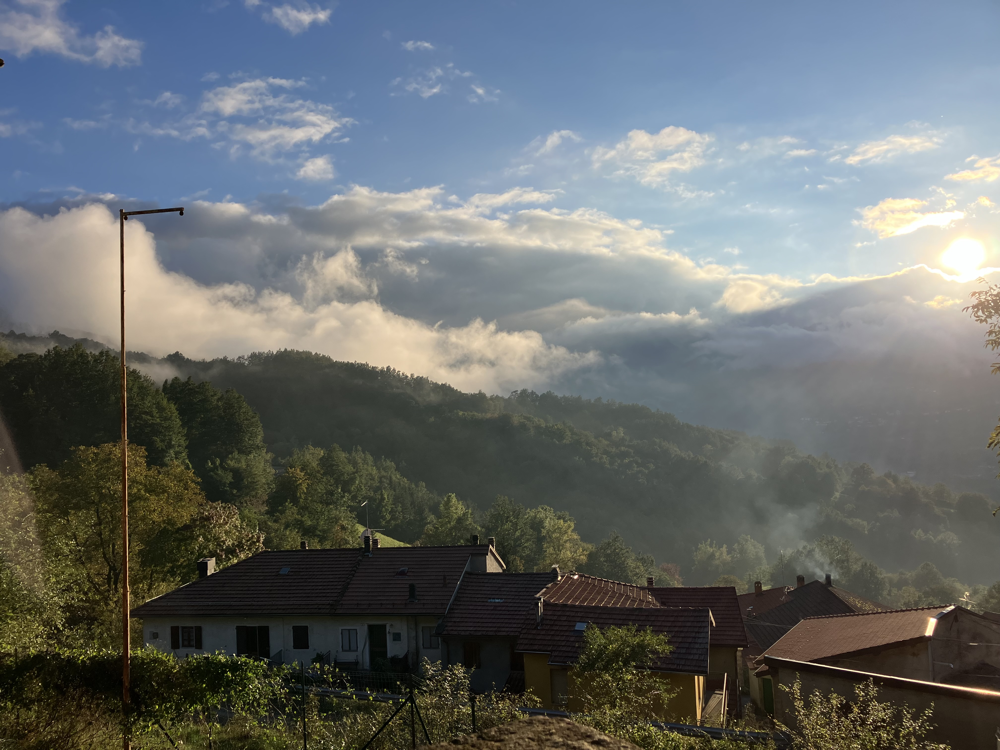

# ATTIVITÀ NOVENA

## Punto su cui lavorare

> Noi siamo liberi di scegliere il nostro servizio:
in un mondo come quello di oggi avere la fortuna di poter scegliere, di avere la libertà di scegliere,
è una cosa da non sotovalutare, da non dare per scontata

## Le tre proposte

### Martedì 16 Dicembre 2025

Nonostante siamo ragazzi (e un anziano) diversi, ognuno con le sue sfaccettature e
*background*, adesso siamo qui perchè **tutti abbiamo scelto di fare parte di un'associazione, di una comunità**.
Per questo pensavamo di cominciare questa nostra Novena 2025 da dove tutto è partito, dalla **Promessa Scout!**  

Vi chiediamo di mandare una **foto/video** della vostra promessa (sia promessa reppi che promessa lupi). Se non la trovate, dovete mandarci un video in cui la si recita in divisa!!!

<!-- ### Mercoledì 17 Dicembre 2025

**Poter scegliere non è da dare per scontato**, ci sono ancora tantissimi paesi e realtà in cui la libertà non c'è, in cui la gente viene oppressa per differenti motivi.
Ne abbiamo prove concrete, spesso anche raccolte in indici come:

* [**World Press Freedom Index**](https://rsf.org/en/index) stilato da Reporters Sans Frontières, quantifica la libertà di stampa di ogni paese
* [**Human Freedom Index**](https://www.cato.org/search/category/human-freedom-index) redatto da Cato Institute, raccoglie le libertà personali, civili, ed economiche di ogni paese
* [**Democracy Index**](https://www.eiu.com/n/campaigns/democracy-index-2024/) creato dal settimanale The Economist, classifica ciascun paese in "democrazie complete", "imperfette", "regimi ibridi" e "autoritari"

Come spunto di oggi vi vogliamo lasciare il **trailer** del film *It was just an accident*, fresco vincitore della Palma d'Oro a Cannes.

> Vahid, un meccanico azero, è stato imprigionato dalle autorità del regime iraniano. Durante il periodo di prigionia, fu interrogato e torturato da bendato con la faccia rivolta al muro.  
Un giorno, un uomo di nome Eqbal entra nella sua officina. La protesi alla gamba dell'uomo produce un suono inconfondibile, uguale a quello che produceva la protesi di uno dei suoi aguzzini.

Il film non è d'azione, tutt'altro, ma il coraggio del protagonista va ben oltre quello di tanti eroi e supereroi. **È il coraggio di chi compie una scelta difficile e per niente banale, in un paese dove la stessa libertà di scegliere è a rischio**.  
Proprio come la scelta fatta dallo stesso regista [Jafar Panahi](https://it.wikipedia.org/wiki/Jafar_Panahi). Nonostante sia già stato condannato ed improgionato in diverse occasioni, decide di creare questo nuovo film a denuncia di quello che è diventato il paese che ama e che, purtroppo, gli
è costato una nuova condanna.

* [Lingua originale](https://youtu.be/9oHw2ubyWE4?si=tytv70SJKZWrvOI_)  
    

* [Italiano](https://youtu.be/nF04v-ze2Yc?si=bCnvnYB-YRu_6nmZ)  
    

### Giovedì 18 Dicembre 2025

Questa foto è stata scattata a Ischia a fine route estiva, presso la comunità   *Papa Giovanni XXIII*. Abbiamo pensato che sia il giusto simbolo per riflettere su un concetto molto importante.  

La fortuna di vivere in un contesto in cui abbiamo una buona libertà di scelta, può portare a prendere la strada più facile, sbagliata ed egoistica come hanno fatto in passato questi ragazzi.

Però, la forza che hanno dimostrato in seguito questi ragazzi decidendo di disintossicarsi, ci fa riflettere che **la libertà di scelta dovrebbe farci sentire la necessità di preferire la scelta giusta ed altruistica, anche se difficile**. -->
